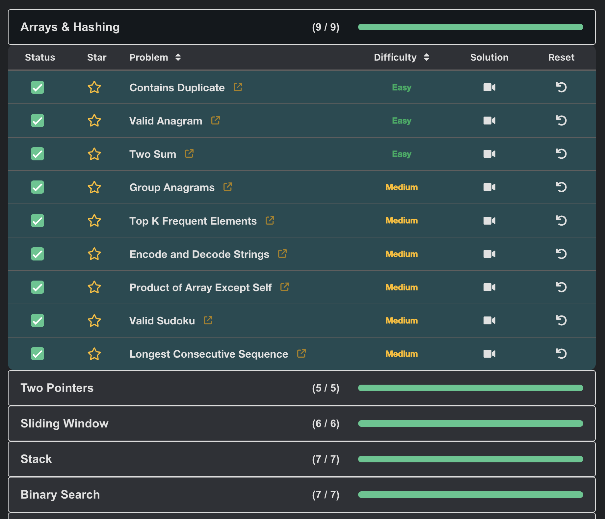

# Neetcode Reset

Adds a button to neetcode.io to reset the solution before opening the problem, in order to be able to revise previously completed problems without spoiling the solution for yourself.

[Install script](https://github.com/felixpackard/userscripts/raw/refs/heads/master/neetcode-reset/main.user.js)

> You must have a userscript extension installed for the install link to work. I'd recommend [Violentmonkey](https://violentmonkey.github.io/).

## Screenshot

